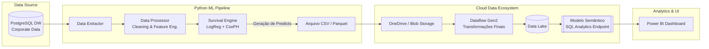
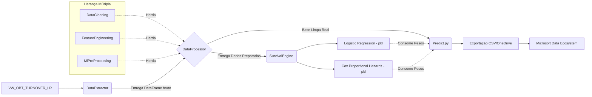

# 📊 Arq People Analytics: Turnover Preditivo & Analise de Sobrevivência


> Uma plataforma end-to-end de People Analytics focada não apenas em prever *quem* tem probabilidade de pedir demissão, mas *quando* isso tende a acontecer, munindoo o RH com uma inteligência temporal acionável.

---
# 🎯 1. O problema & A Solução
O turnover oculto sangra o caixa das empresas. Tradicionalmente o RH atua de forma **reativa**: a gestão de pessoas só entra no fluxo **depois** que o talento já entregou a carta de demissão.

**A Solução Preditiva:** Em vez de atuar no escuro, este projeto consome dados históricos, limpa e modela as variáveis de risco, e aplica duas abordagens de UA:
1. **Modelagem de Risco (Classificação)**: Identifica o risco probabilístico do colaborador pedir demissão.
2. **Análise de Sobrevivência (Time-to-Event):** Mapeia a curva temporal de retenção, entendendo o impacto das variáveis no ciclo de vida do talento.

O resultado é integrado diretamente a um ecossistema Microsoft, gerando um modelo semântico robisto que alimenta painéis gerenciais no Power BI.

---
# 🏗️ 2. Arquitetura Corporativa (Data & MLOps)
A arquitetura foi projetada para ser modular, dissociando a engenharia de machine learning da camada de visualização, garantido total governança e perfomance.


### 🏛️ 2.1 Arquitetura Geral


### ⚙️ 2.2 Fluxo de Arquivos


### 📂 2.3 Estrutura de Pastas
```text
APA_People_Analytics/
├── Data/                    # Repositório local de dados (Blindado pelo .gitignore)
│   ├── Raw/                 # Backups físicos dos dados brutos extraídos do DW
│   └── Processed/           # Features processadas, base limpa e pronta para treino
├── Logs/                    # Camada de observabilidade e auditoria
│   └── logs_lr_model.log    # Log rotativo com telemetria da execução do pipeline
├── Models/                  # Artefatos seriais treinados pelos algoritmos
│   ├── cox_turnover_model.pkl # Pesos matemáticos calibrados do modelo de sobrevivência (CoxPH)
│   └── lr_turnover_model.pkl  # Pesos matemáticos calibrados do classificador binário (LogReg)
├── query/
│    └── OBT_Feature.sql
├── Src/                     # Código-fonte principal (Core Python)
│   ├── __init__.py          # Inicializador do pacote de módulos
│   ├── DataCleaning.py      # Mixin: Higienização de nulos e prevenção de Data Leakage
│   ├── DataConnection.py    # Classe Base: Mapeamento de ambiente e conexão PostgreSQL
│   ├── DataExtractor.py     # Classe Base: Extração da OBT e salvamento de RAW Data
│   ├── DataProcessor.py     # Classe Central: Herda os mixins e orquestra a preparação dos dados
│   ├── FeatureEngineering.py# Mixin: Aplicação de regras de negócio corporativas e temporalidade
│   ├── logger.py            # Utilitário: Configuração de loggers rotativos para o terminal/arquivo
│   ├── MlPreProcessing.py   # Mixin: Fatiamento estratificado e padronização (StandardScaler)
│   └── SurvivalEngine.py    # Motor de Treino: Calibração matemática e exportação de artefatos
├── main.py                  # Script Orquestrador: Executa o pipeline de ponta a ponta (Fit)
├── predict.py               # Motor de Inferência: Consome os .pkls e a base nova (Predict)
├── README.md                # Documentação oficial, arquitetura de dados e MLOps
├── .env                     # Variáveis de ambiente corporativas (Credenciais do DW)
├── .gitignore               # Regras de exclusão de artefatos locais (Logs, PKLs, CSVs)
└── requirements.txt         # Mapeamento estrito de dependências do ecossistema Python
```
---

# 🗄️ 3. Pipeline de Processamento (Data Processor)
A origem dos dados é a uma OBT (One Big Table) criando em uma view para abstração máxima de dados e segurança da informação `vw_obt_turnover_lr` extraída do Data Warehouse corporativo via SQLAlchemy.
O motor de `DataProcessor` executa um pipeline rigoroso:
- **Data Cleaning:** Tratamento de nulos com regras de negócio claras e prevenção de Data Leakage removendo variáveis do futuro (ex: IDs, data de demissão).
- **Feature Engineering:** Cálculo preciso de `meses_de_casa` ancorado em uma data de corte, discretização de salários e idades, e flags estratégicas de negócio, como a identificação de um departamento específico e mapeamento de dependentes.
- **ML Pre-Processing:** Divisão estratificada (80/20) e aplicação de `StandarScaler` apenas em variáveis contínuas rigorosamente selecionadas, blindando variáveis temporais de distorções matemáticas.
---

# 🧠 4. Modelagem Matématica (Survival Engine)
O motor preditivo (`SurivalEngine.py`) foi construído com foco absoluto em Explicabilidade **(XAI)**. Não foi utilizado modelos considerados "caixas pretas".
1. **Regressão Logística (Classificação):** Utiliza um pipeline  que combina balanceamento de sintético de classes com SMOTE (`k_neighbors = 2`), regressão logística (`salver = 'liblinear'`) e balanceamento de classes desiguais (`class_weight = 'balanced'`).
   - Avaliado através de limiares de decissão ajustados (0.39) para otimizar o `Recall` e identificar quem realmente está em risco.
2. **Modelo Cox Proportional Hazards (Sobrevivência):**
   - Treinado com o algoritmo de Lifelines (`penalizer = 0.1`), calcula o _Hazard Ratio_
   - Permite responder à pergunta: _"Dado que o colaborador está na empresa há X meses, qual a chance dele continuar conosco no próximo mês?"_
   - Validação a frio utilizando a métrica _Concordance Index (C-Index)._
---
# 🛡️ 5. Governança e Consumo (Power BI)
O projeto foi concebido sob a premissa de Privacy by Design:
- **Minimização de Dados:** Dados PII (identificadores pessoais) e sensíveis são proativamente removidos (`drop_leakage`) antes da modelagem matemática.
- **Anonimização Estatística:** O motor de inferência trabalha exclusivamente com matrizes numéricas padronizadas e codificadas, sem vínculo nominal direto na memória da IA.
- **Observabilidade (S-Rank):** Sistema de telemetria via `RotatingFileHandler` que limita logs a 5MB, garantindo auditoria granular (Timesatmp, Erro, Linha de código) sem compromenter o armazenamento do servidor.
---
# 📊 6. Analytics & Visualização (Power BI)
A saída dos modelos gera os _predicts_ que são alocados no OneDrive e ingeridos por um DataFlow Gen2. Após o refinamento no Data Lake, o Modelo Semântico é consolidado, permitindo o consumo analítico robusto via SQL Endpoint.
A camada visual (Front-end no Power BI) fpo desenhado com rigor estético e técnico:
- **Design Minimalista:** Uma interface corporativa limpa, oferecendo respiro visual e imersão analítica.
- **Target List:** Relatório acionável detalhando os talentos com maior probabilidade de evasão cruzado com seu tempo de casa projetado.

---

# ▶️ 7. Como Executar

1. **Configuração de Ambiente**:
```bash
git clone [https://github.com/SeuUsuario/arq-people-analytics.git](https://github.com/SeuUsuario/arq-people-analytics.git)
cd arq-people-analytics
python -m venv venv
source venv/bin/activate  # Windows: .\\venv\\Scripts\\activate
pip install -r requirements.txt
```

2. **Variáveis de Ambiente** (.env):
Configure
```bash
BD_USER
DB_PASS
DB_HOST
DB_PORT
DB_NAME
DB_SCHEMA 
```

3. **Execução do Pipeline Completo:**
```bash
python main.py 
```